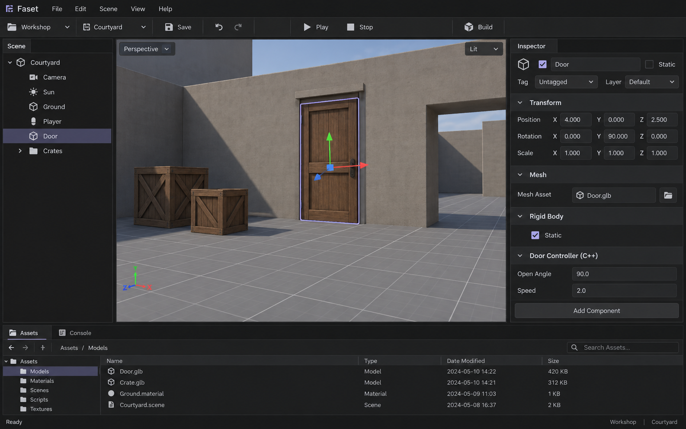

# Editor visual reference

Generated before editor UI implementation with the built-in image generation tool.
This is a design reference, not a screenshot of a working Faset build.

## Implementation direction

- Large central viewport; Scene tree left; property Inspector right; Assets/Console below.
- Near-black flat surfaces, muted separators, readable English text, restrained lavender selection.
- Compact rows and field groups; no decorative cards, glows or gradients.
- Preserve keyboard focus, Unicode text, resize, and clear disabled/error states.
- Implement the controls as retained C++ widgets. The reference bitmap is never used as an interactive UI background.
- Generated sample file sizes/dates, decorative controls and detailed viewport models are illustrative. Only implemented features belong in the actual editor.

## Generation prompt

Use case: ui-mockup. Purpose: visual prototype before implementing Faset Engine, a professional native desktop 2D/3D game editor. One coherent straight-on 16:10 desktop screenshot, high fidelity, no device frame. English UI only. Main user task: edit a small 3D level, select a Door, adjust its Transform and C++ behavior, then Play or Build. Composition: compact top menubar reading 'Faset', 'File', 'Edit', 'Scene', 'View', 'Help'; second modest toolbar with project 'Workshop', scene 'Courtyard', Save, undo/redo, central Play triangle / Stop square and Build on right. Left narrow Scene panel with a readable tree: Courtyard, Camera, Sun, Ground, Player, Door (selected), Crates. Large central perspective viewport taking about 60 percent width, a simple actual engine greybox scene with a floor grid, a modest warm grey rectangular wall and wooden brown door, a couple of plain crates, selection outline and thin XYZ transform gizmo on the door; no impressive photoreal fantasy rendering or claims. Right Inspector about 290 pixels wide, Door name, stacked plain compact component sections Transform with Position X Y Z / Rotation / Scale numeric fields, Mesh with Door.glb asset, Rigid Body with Static, Door Controller with Open angle 90 and Speed 2, Add Component button. Bottom short dock Assets tab and Console tab, Assets breadcrumb 'Assets / Models', understated file list Door.glb, Crate.glb, Ground.material, Courtyard.scene, plus bottom status 'Ready'. Visual direction: quiet dark surfaces like Obsidian and Notion dark mode, flat charcoal blacks #181818 panels, #202020 viewport background, #242424 inputs, subtle single-pixel separators #323232, clear light grey text #d6d6d6, muted secondary #909090, small restrained desaturated lavender-grey selection accent only. Readable modern sans-serif, 13-14px equivalent, compact consistent spacing, normal case panel names, flat functional rows and barely rounded controls. No gradients, glows, glass, cards around every property, marketing headings, decorative dots, invented metrics, huge typography, neon, or decorative dashboard widgets. The viewport content is illustrative; all editor UI must be realistic and implementable with custom retained C++ widgets. Output only this one reference screen.
