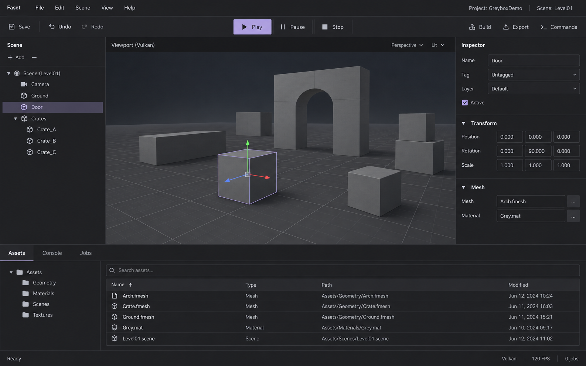
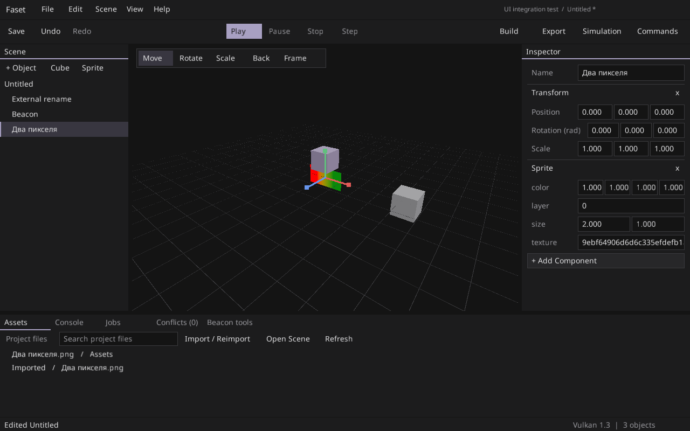
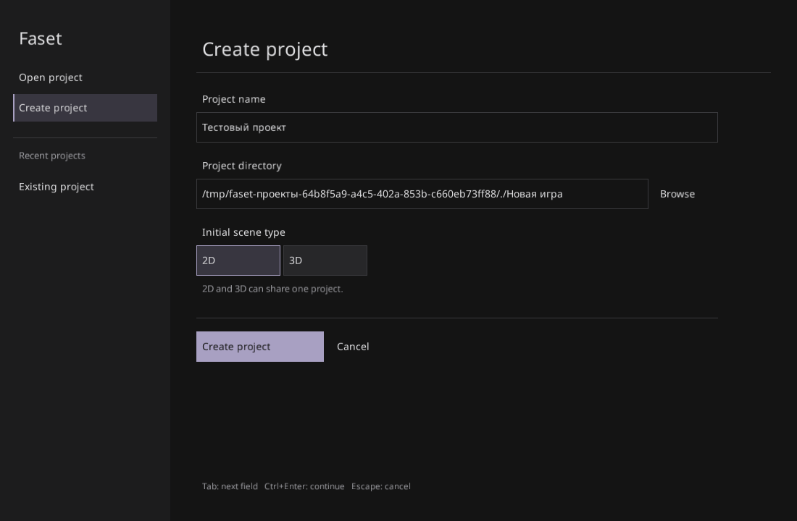

# Editor visual direction — 2026-09-23

Generated with the built-in image generation tool before changing the native editor UI. This is a visual reference, not a working Faset screenshot or a feature specification. The generated scene, icons, asset columns, FPS counter, tag/layer controls and viewport shading are illustrative. The implemented controls must reflect real Faset behavior.

## Implemented native UI

These are Vulkan captures from the Linux UI integration tests after the redesign. Their test project data and viewport contents are examples; the interaction model is defined by the native UI and editor code.

## Design brief

- A quiet graphics workbench: the rendered scene is the focal point; tool chrome recedes.
- Near-black neutral surfaces: background `#141414`, panels `#1c1c1d`, raised controls `#272729`, hairline borders `#3a3a3d`.
- Light text `#e0e0e2`, secondary text `#9a9a9f`, restrained lavender `#a8a0c2` for focus, selection and the primary Play action.
- Keep Noto Sans for the native editor's single-font Unicode pipeline; use size and spacing for hierarchy. Compact 14 px controls and 28 px rows.
- Retain the real Scene / viewport / Inspector / bottom dock layout, stable widget IDs, keyboard focus, editor commands and MCP parity. Use no raster screenshot as an interactive background.
- Make secondary actions quiet; keep explicit input fields and modal actions legible. Show file names first and preserve full asset paths in tooltips. Keep import freshness visible at the start of imported asset rows.

The generated prototype was requested with the current editor's real regions and actions, a simple greybox scene and flat retained-mode controls. The visual hierarchy, palette and density are the reference; the repository's UI code and authoring contract determine functionality.
