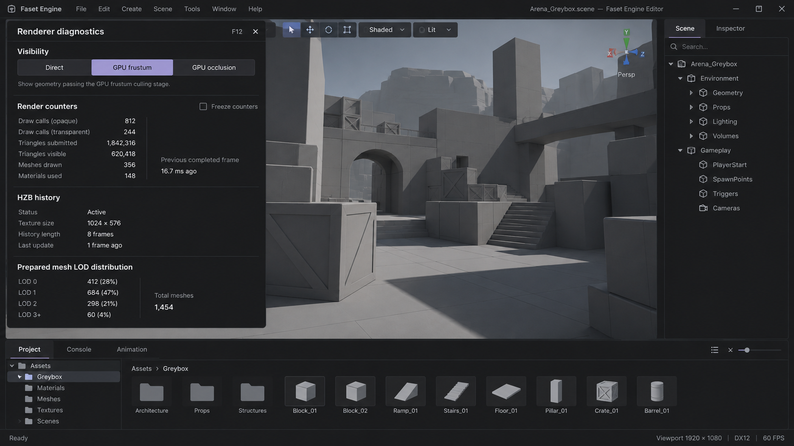
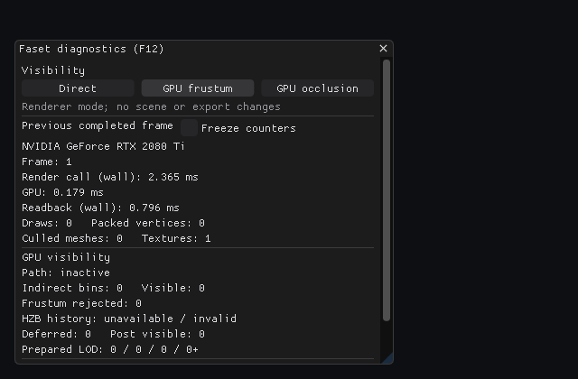

# P2 visibility diagnostics visual reference

Generated with the built-in image generation tool before implementing the developer overlay. This is a visual prototype, not a Faset screenshot or a feature specification. The greybox scene, values, metrics, and viewport controls in the generated image are illustrative. In particular, Faset does not report the prototype's triangle-visibility, HZB texture-size, or history-length numbers.

The implementation uses the prototype's compact three-mode visibility selector, near-black surfaces, restrained lavender selection, simple dividers, and grouping. It only reports actual `Renderer::FrameStats` fields and retains the existing ImGui diagnostics behavior. The runtime renderer and source code define functionality.

The second image is the actual 640 × 420 test capture with a deliberately empty scene. It verifies the selected GPU frustum button and the real counters, with the panel scrolling on a small viewport.
