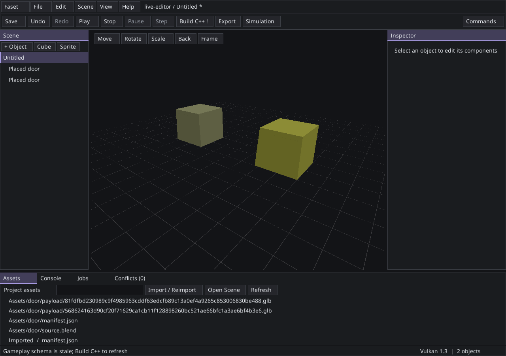

# Checkpoint 5 Linux acceptance

These functional checks used the engine source at
`0f34b036313c011861dbfd5828ed45c4f7940b05`. They supplement the earlier Release
performance baseline; export runs overlapped compilation and are not benchmarks.

- [Clean offline build](offline.json): committed source extracted with `git archive`,
  empty build directory, external networking disabled, prefetched dependencies and
  toolchain. Full default native build and 20 CPU tests passed in 205.77 seconds.
- [First Editor launch](first-run.json): that freshly built default Editor created
  a new 3D project following the Manual's command, copied the correct gameplay
  templates and rendered three native X11/Xvfb frames before closing successfully.
- [Both standalone games](playable-exports.json): the real Editor produced Release
  packages, verified package hashes, moved them outside the SDK into Unicode paths,
  hid source projects, then validated and rendered 120 frames per game without
  scene/asset overrides. RTX 2080 Ti, Khronos validation active, zero validation
  errors. The packages contained 17 files for 2D and 22 for 3D.
- [Blender round-trip](blender.json): unmodified Blender 4.5.3 and the actual live
  Editor probe updated two instances while preserving IDs, transforms, tint, physics,
  opaque gameplay and document revision. Removed outputs kept the last good visible
  generation. The verification harness was updated to distinguish source freshness
  from active-generation preservation; its separate hash is included in the report.

- [Editor recovery](recovery.json): seven failure/recovery scenarios passed against
  the same source revision and recorded Editor hash: interrupted process, explicit
  journal recovery, failed save/import/build/Player startup, and subsequent recovery.

The integrated build with optional diagnostics also passed 34 tests with one
explicit native Wayland restore skip; the sanitizer configuration passed 18/18.
These results describe Linux. Windows has separate CI and export evidence.
Native OS IME composition and moving between physical monitors were not exercised;
widget composition, DPI and native SDL input-boundary tests have narrower scope.

The following image is an actual Editor capture from the Blender probe, after
rename/geometry reimport. It is not the generated UI reference. The test scene has
two placed instances and no selected object.

