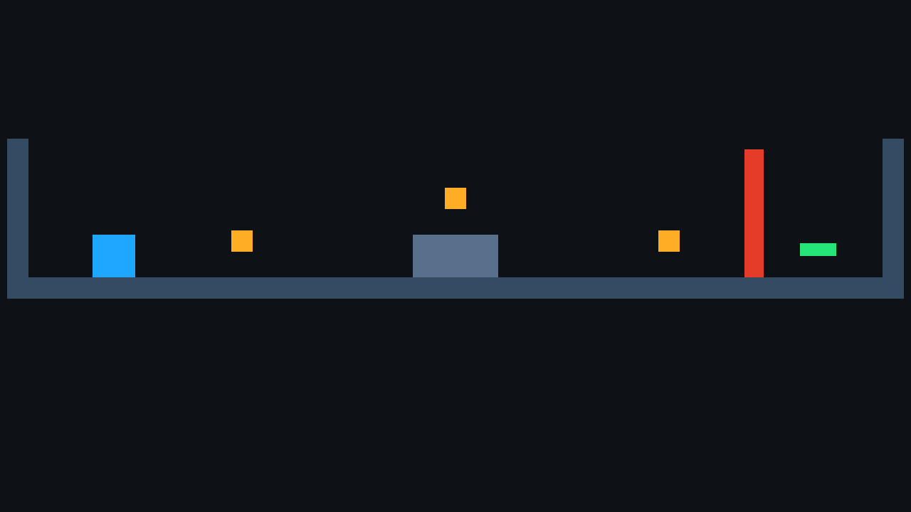
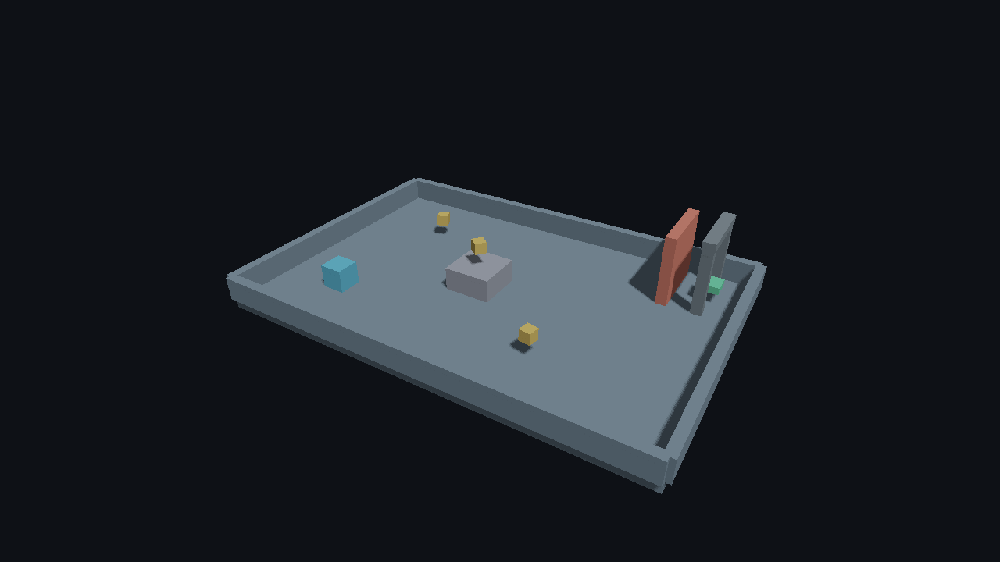

# Final Linux source checks — 2026-09-18

Engine source: **`4cb82556de31268d2bde73948dd1ff1b6c02f162`**. Both Release games
were exported from a clean working tree at this commit, which remained unchanged
through completion. Editor SHA-256:
`05e2b40c6c05282af71a03990c98c89c673c48a3cf1da0e17a59f911a947049a`.

The [export report](playable-exports.json) records both checked-in projects, their
source hashes, package generations and relocation. The 2D package contains 17 files;
the 3D package contains 22, including the imported Blender arch. Each package passed
CPU validation and 120 offscreen frames after being moved into a `Faset Café 世界`
directory outside the SDK, with the disposable source-project paths hidden. No scene
or asset-directory override was supplied. Package hashes are preserved in the
[2D manifest](collect-2d-manifest.json) and [3D manifest](collect-3d-manifest.json).

Both ran on the physical NVIDIA RTX 2080 Ti with the Khronos validation layer active
and zero reported errors. The [2D run](collect-2d-run.json) and
[3D run](collect-3d-run.json) retain the observed device and counters. Capture hashes
match the preceding checkpoint 5 candidate exactly. These runs are functional
acceptance evidence; the timings retained in the export report are not a controlled
performance benchmark. The separately scoped
[240-frame baseline](../linux-release-2026-09-18/README.md) remains historical evidence.

A further [SDK-unavailable check](sdk-unavailable.json) ran these same packages in a
private user/mount namespace with an empty read-only filesystem covering the entire
Faset checkout, including Editor, builds, cached tools and project copies. Each used
an unrelated empty working directory and fresh home/config/cache directories. Both
passed validation and another 120 frames, with active Vulkan validation, zero errors
and identical capture hashes. File/process tracing found no SDK path accesses or
helper executables; dynamic dependencies resolved to system libraries, with no ELF
RPATH/RUNPATH. The outer SDK was never renamed or hidden and remained unchanged.
The report preserves namespace/mount details and hashes of the retained local traces
and harness. This establishes SDK independence on this Linux host, not universal
distribution or driver compatibility; Windows has separate package checks.

[Test results](tests.json) record 34 passed, one explicit native Wayland restore skip
and zero failed in the 35-test integrated suite with optional diagnostics enabled.
The compositor declined programmatic restore; the skip does not establish that
operation's correctness. XWayland has its own passing
[window record](../native-window-linux-2026-09-18.json). Full ASan/UBSan passed 18/18
on `0f34b03`; the two affected asset/cook tests passed again after the source-location
correction at `4cb8255`.

The preceding [checkpoint 5 record](../checkpoint5-linux-2026-09-18/README.md)
retains the clean offline build, first project launch, all seven recovery scenarios
and live Blender reimport with their exact source/harness provenance. These checks
were not silently relabeled as runs of a later commit. Physical OS IME composition,
mixed-monitor transitions and other GPU/driver families need separate coverage.

Reproduce the export check from the repository root:

```sh
python3 tools/verify_playable_exports.py --editor build/linux-debug/faset_editor \
  --output .cache/playable-verification
```

Actual standalone captures:




