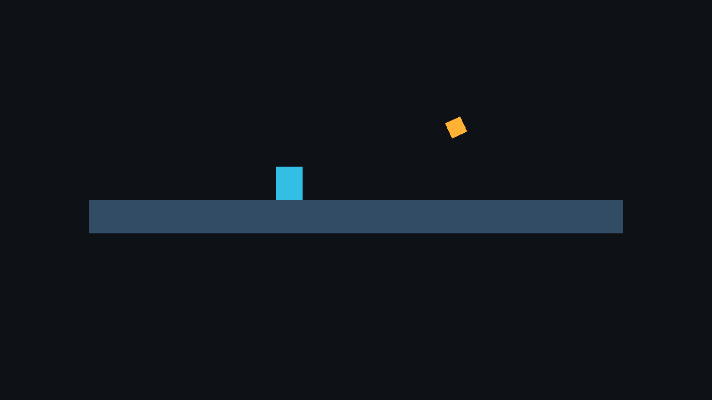

# Lua-only Release game: relocated execution

This is a local Linux result for source revision
`433185717e1f324acb6eaf186818589d11697453` on 2026-09-24. The
[machine-readable report](report.json) records the exact source input hashes,
Release package, Editor binary hash, command arguments and elapsed times. The
Editor itself was built with the `linux-release` preset. The exported Player
and package also identify their configuration as Release.

| Check | Observed result |
|---|---|
| Disposable source | `examples/lua` copied to a Unicode-path temporary project outside the engine tree |
| Package | `lua_enabled: true`; 32 hash-checked files, including Lua gameplay source and `Notices/lua/LICENSE.txt`; no project `Gameplay.cpp` or `.hpp` |
| Relocation | Generation copied outside the project/engine; original project path hidden before Player launch |
| CPU validation | Packaged Player `--validate` succeeded from an unrelated empty working directory |
| GPU execution | 120/120 headless 1280×720 frames, 0 validation errors |
| Device | NVIDIA GeForce RTX 2080 Ti; proprietary driver 595.84, Vulkan 1.4.329; selected-device details in the report and [Vulkan probe](vulkaninfo-summary.txt) |
| Image | Four expected scene colors, including cyan player and gold collectible; raw [PPM](lua.ppm) SHA-256 `e2f4c3b84de75dadd2e31d388d0ba51abc1861f1ec76eb7ba51a4a2dcac720a7` |
| Focused Release CTest | 5/5: `lua_contracts`, `lua_safety_contracts`, `lua_cli_contracts`, `lua_player_reload`, `build_schema_publication` |

The [manifest](lua-manifest.json) binds the package file checksums. The
[Player profile](lua-profile.json) contains all 120 per-frame samples and
resource/timing definitions; the [validate](lua-validate.json),
[render](lua-run.json) and [export](lua-export.json) logs retain raw process
results. The [PNG preview](lua.png) is a lossless conversion of the checked
PPM.

The verifier also confirmed a clean Git source tree, rejected undeclared
package files and unexpected C++ script files, classified the selected device
as physical, and found the sample Lua `on_start` log in the relocated run.

To repeat this check from a built checkout, choose a **new, empty** output
directory:

```sh
cmake --preset linux-release
cmake --build --preset linux-release --target faset_editor --parallel 4
python3 tools/verify_playable_exports.py --editor build/linux-release/faset_editor \
  --output .cache/lua-release-check --only-lua
cmake --build --preset linux-release --target faset_player faset_schema_exporter \
  faset_lua_tests faset_lua_safety_tests faset_build_schema_tests --parallel 4
ctest --test-dir build/linux-release --no-tests=error --output-on-failure \
  -R '^(lua_contracts|lua_safety_contracts|lua_cli_contracts|lua_player_reload|build_schema_publication)$'
```

The render used the Player's synthetic fixed timestep and offscreen Vulkan
presentation. It does not establish manual window interaction or physical
Windows GPU compatibility. The separate
[Windows graphics run at `4ac02ee`](https://github.com/emil28092005/Faset_Engine/actions/runs/35937433040)
passed 61/61 CTests and relocated all three Release games under pinned SwiftShader.
The Lua-only package validated and completed 120 offscreen frames with its source
project paths hidden. Its device is a **software** Vulkan implementation; the
Khronos validation layer was not active on that Windows worker. The
[P1 dossier's Windows report](../p1-iteration-2026-09-24/windows-4ac02ee/playable-report.json)
retains the source/package identities and result. This does not establish
physical Windows GPU compatibility.


