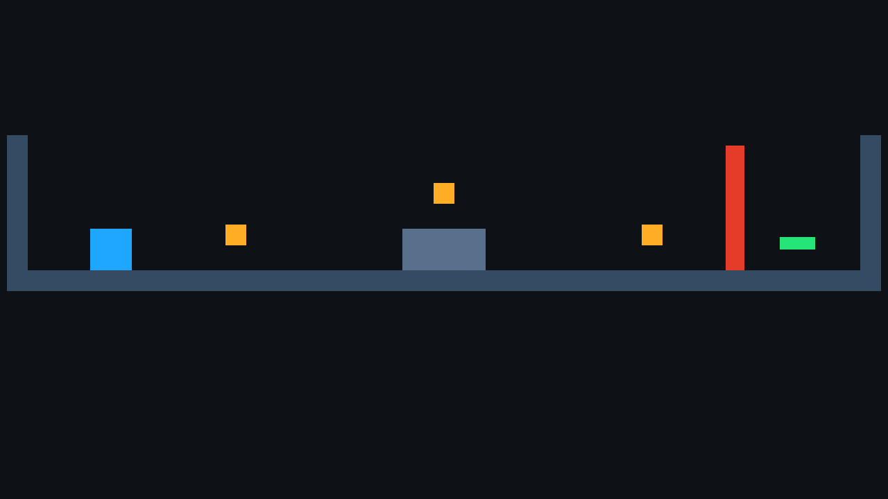
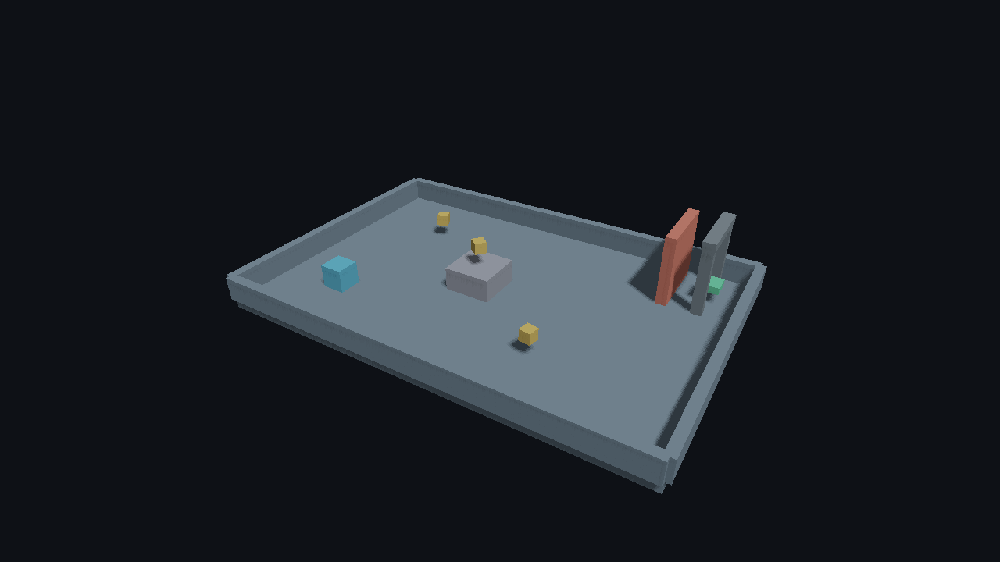
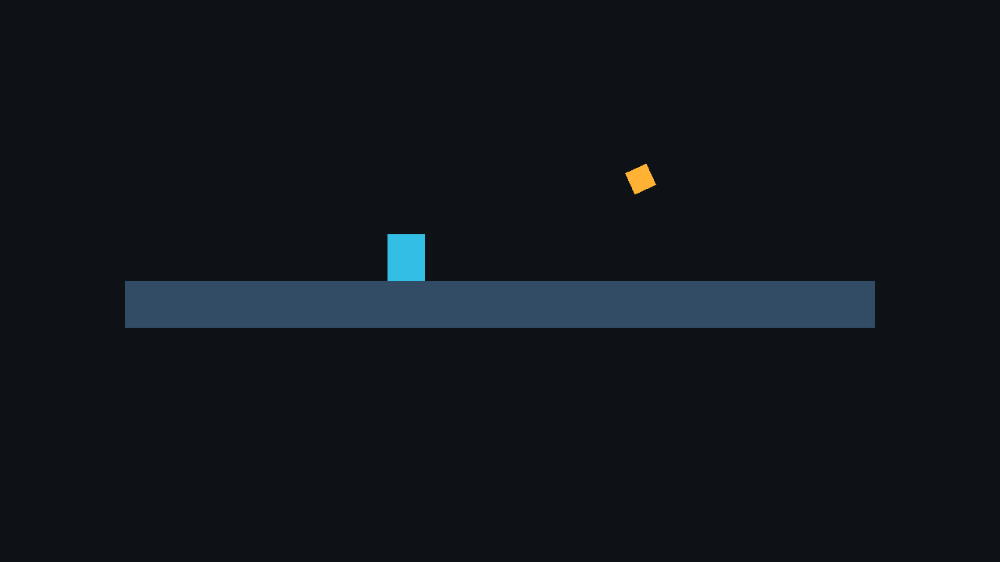

# Final combined P1/P3 Release reference — 2026-09-24

This is the clean-source, physical-GPU reference for the checked-in playable
`collect-2d`, `collect-3d`, and Lua-only games at
`4a3453e2b1868555d833f578d43f48b8bc47d41a`. The real Release Editor
exported each project to a self-contained package. The packages were copied to
Unicode-named paths outside their disposable source projects, and those source
paths were hidden while each Player ran from an unrelated empty working
directory. The 3D export imported and packaged the Blender exit arch. All three
games passed standalone CPU validation and rendered **120/120** offscreen Vulkan
frames on the physical NVIDIA GeForce RTX 2080 Ti with the Khronos validation
layer active and **zero validation errors**. The [verifier report](report.json),
[2D manifest](evidence/collect-2d-manifest.json),
[3D manifest](evidence/collect-3d-manifest.json), and
[Lua manifest](evidence/lua-manifest.json) retain input, package and binary
hashes. The [toolchain supplement](provenance.json) binds the unmodified report
and 240-frame summary to the exact Editor, CMake, Ninja, Clang and Slang
binaries. The verifier recorded a clean checkout at its start, and the second
profiles used the same relocated Player binaries.

| Relocated package | Runtime | Frames | GPU validation | Source paths hidden |
| --- | --- | ---: | --- | --- |
| `collect-2d` | C++ | 120/120 | active, 0 errors | yes |
| `collect-3d` | C++ with Blender asset | 120/120 | active, 0 errors | yes |
| `lua` | Lua-only | 120/120 | active, 0 errors | yes |

The two **same relocated C++ executables** then ran a second, sequential
240-frame profile. For each run, the disposable source-project paths were again
hidden and restored afterward. These exact 2D/3D samples used default Direct
visibility and temporal Off, 1280×720 offscreen Vulkan, synchronous readback,
the active Khronos validation layer and synthetic fixed-step simulation. No
frame was discarded as a warm-up: the table uses nearest-rank p95 over all 240
completed frames, including the first. Both profiles report zero validation
errors. Raw [2D](reference-240/collect-2d-profile-240.json) and
[3D](reference-240/collect-3d-profile-240.json) profiles, exact
[2D invocation](reference-240/collect-2d-run-240.json) and
[3D invocation](reference-240/collect-3d-run-240.json), and the
[machine-readable budget comparison](reference-240/reference-summary.json)
support every value below.

| Exact-scene observation | Initial P1 tracking budget | 2D | 3D |
| --- | ---: | ---: | ---: |
| Frame wall p95 | ≤4 ms | 2.694 ms | 3.036 ms |
| GPU timestamp p95 | ≤1 ms | 0.573 ms | 0.617 ms |
| Readback CPU p95 | ≤1 ms | 0.559 ms | 0.561 ms |
| Simulation p95 | ≤0.5 ms | 0.242 ms | 0.300 ms |
| Scene snapshot p95 | ≤0.5 ms | 0.197 ms | 0.288 ms |
| `main()` to first frame | ≤500 ms | 295.4 ms | 248.3 ms |
| Maximum explicit Vulkan allocation | ≤20 MiB | **43.022 MiB — miss** | **43.118 MiB — miss** |

The memory miss is real, not a profile rounding artifact: 2D used 45,112,032
bytes and 3D used 45,212,272 bytes, while the earlier threshold was 20,971,520
bytes. Each run counted a **16 MiB sun atlas and a 16 MiB local-light atlas**
inside the live Vulkan allocation total. The 2D sprites produced no sun-shadow
raster work; the 3D meshes rendered four sun cascades. Neither sample used a
local shadow face. Both 2048² D32 atlases are currently allocated when the
Renderer is created, even when the scene never uses them. The remaining explicit
allocations were 11.022 MiB (2D) and 11.118 MiB (3D). Lazy local-atlas
allocation is a sensible follow-up, but alone it would still leave the 3D
scene above 20 MiB with its current 2048² sun atlas. We have kept the physical
counter and shadow resolution intact and recorded the miss rather than silently
changing either to satisfy an older threshold. The 20 MiB value is an initial
**tracking budget** for tiny pre-P3 scenes, not a functional export gate; any
revised shadow-memory budget needs its own measured baseline.

The Lua run establishes relocated Release execution, not a 2D/3D latency
budget. The [2026-09-18 Release reference](../../linux-release-2026-09-18/README.md)
used these scenes on the same GPU but an evolving earlier working tree; its
numbers are historical context, not this clean combined revision. This run
measures small scenes on one active Linux desktop and one driver (NVIDIA
595.84). GPU timestamps exclude CPU work, `renderer_readback_cpu` is a
map/copy/unmap duration inside the renderer call, and the explicit allocation
counter excludes driver-internal memory. It does not establish production-game
scaling, whole-process VRAM usage, display-paced FPS, physical Windows GPU
performance or absence of all leaks.

## Reproduce and inspect

From this repository with the dependencies configured:

```sh
cmake --preset linux-release
cmake --build --preset linux-release --target faset_editor --parallel 2
python3 tools/verify_playable_exports.py \
  --editor build/linux-release/faset_editor \
  --output /tmp/faset-p1-release-new \
  --standalone-root /tmp/faset-p1-packages-new \
  --include-lua
python3 docs/validation/p1-iteration-2026-09-24/final-release/profile_exact_scenes.py \
  --verification /tmp/faset-p1-release-new/report.json \
  --output /tmp/faset-p1-release-new/reference-240
```

Use **new, empty** output and standalone directories. The second helper
refuses an incomplete or dirty-tree verifier report, hides the disposable
source projects during each 240-frame run, checks exact settings and validation,
then restores them. The original [verifier log](verifier.log),
[240-frame log](reference-240.log), raw 120-frame profiles for
[2D](evidence/collect-2d-profile.json),
[3D](evidence/collect-3d-profile.json) and
[Lua](evidence/lua-profile.json), PPM captures, and the
[SHA-256 file list](SHA256SUMS.txt) are retained here. The
large disposable native build directories and relocated executable packages
remain under `/tmp`; their input, manifest and executable hashes are in the
reports.






