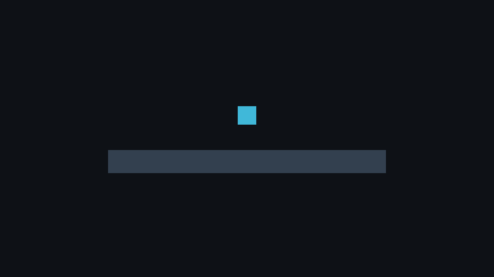
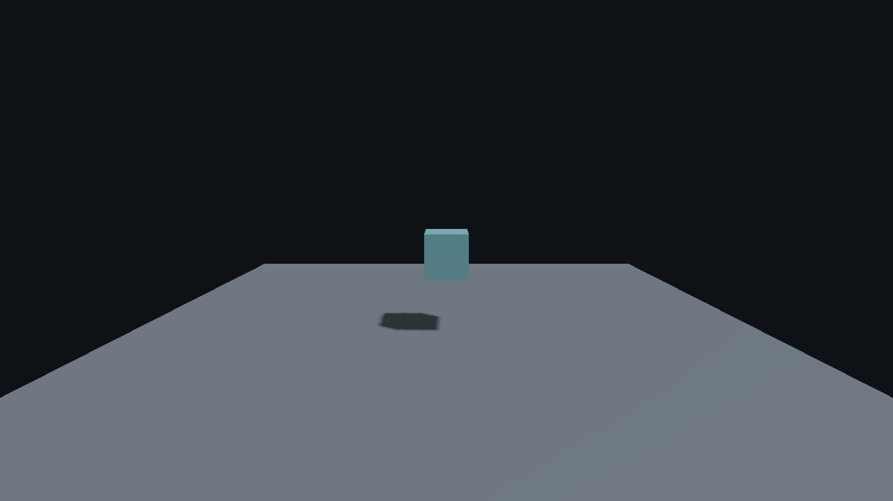

# P1 starter projects: Linux checkpoint (2026-09-24)

This is a focused validation of the four explicit new-project choices in commit
`cbb8b4508723e1a3a0bbd53c884e116a47b121dc`. It is not the final P1 acceptance
record. The run used Linux 7.0.0-31-generic x86_64, Clang 21.1.8, CMake 4.2.3,
and an NVIDIA GeForce RTX 2080 Ti with driver 595.84.

The Editor CLI created C++ 2D, C++ 3D, Lua 2D, and Lua 3D projects in disposable
directories with `--new`, `--dimension`, and `--language`. The test checked the
project manifest, authored start scene, behavior binding, Lua script declaration,
LuaLS files, and the absence of a C++ gameplay stub in Lua-only projects. A real
Debug `faset_build` succeeded for C++ 2D and Lua 3D. Their built Players then
validated and rendered **both** corresponding scene dimensions using the same
language module, so all four templates exercised runtime schema and rendering.
Each headless one-frame render reported `validation_errors: 0` on the physical GPU.

| Project | Built Player used | `--validate` | One-frame headless render |
| --- | --- | --- | --- |
| C++ 2D | C++ 2D | passed | passed |
| C++ 3D | C++ 2D | passed | passed |
| Lua 2D | Lua 3D | passed | passed |
| Lua 3D | Lua 3D | passed | passed |

The C++ and Lua source files are identical within each language choice; the 2D/3D
difference is the authored scene. Reusing one built Player per language therefore
checks scene validity without repeating an identical native compile. The focused
CTest cases `process_and_cook` and `editor_ui_launcher` passed 2/2. They include a
two-service concurrent creation test: exactly one starter wins, and the other
cannot overwrite it. A fresh Lua starter was initialized as a Git repository;
`git check-ignore` confirmed `.faset/cache` is ignored while the LuaLS API
declaration `.faset/lua/faset.lua` can be committed. A strict MkDocs build passed.

These captures are representative output from the C++ 2D and 3D scenes. Lua
scenes rendered the same layout with their own behavior module.

The run did not test Windows, a relocated Release export, multi-frame gameplay
input, or the final P1 build-cache integration. Those belong to the P1 acceptance
matrix and must be recorded separately.
