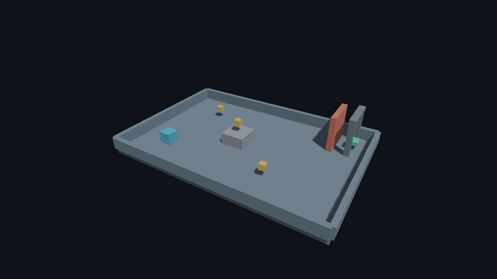

# P2 GPU visibility: Linux validation, 2026-09-23

The P2 implementation adds selectable GPU frustum and two-pass HZB occlusion for opaque static meshes, prepared mesh LODs, renderer and Editor diagnostics, and a standalone Player option. Direct rendering remains the default and comparison path. The code built and tested here is at `9990234` (following `3be3d0d` for device-local GPU outputs); the later working-tree changes while gathering this record were documentation only.

## Builds and functional tests

| Environment | Check | Result |
| --- | --- | --- |
| Ubuntu Linux, Clang 21, Debug, RTX 2080 Ti | `cmake --build --preset linux-debug -j6`; `ctest --test-dir build/linux-debug --output-on-failure -j6` | Build passed; 57/57 tests passed, including 15 P2 cases. `render_window_lifecycle` reported its pre-existing compositor skip. |
| Ubuntu Linux, Clang 21, Release, RTX 2080 Ti | `cmake --build build/p2-release -j6`; `ctest --test-dir build/p2-release --output-on-failure -j6` | Build passed; 57/57 tests passed, with the same window skip. |
| Linux lavapipe software Vulkan | `VK_ICD_FILENAMES=/usr/share/vulkan/icd.d/lvp_icd.json ctest --test-dir build/p2-release -L p2 --output-on-failure -j2` | 15/15 P2 cases passed; the frustum and occlusion examples each reported an active GPU path, both prepared LOD levels, and zero Vulkan validation errors. |
| Release shader bundle | `spirv-val --target-env vulkan1.3` on all nine generated `.spv` files | All passed. |

The 15 P2 cases include empty and dense scenes, fixed-bin capacity, camera cut, resize, near-plane handling, multiple views, projection change, teleports, shadow and transparent passes, LOD selection and an open sequence. This is functional coverage, not a performance claim.

The complete [Debug CTest log](ctest-linux-debug.txt), [Release CTest log](ctest-linux-release.txt) and [lavapipe P2 log](ctest-lavapipe-p2.txt) retain every test name and the explicit window skip. The [shader validation record](shader-validation.txt) lists hashes and `spirv-val` results for the Release bundle.

## Independent exported Player checks

The [export report](report.json) records a Release export through the real Editor for both checked-in playable projects. Their packages were copied outside the SDK into a Unicode path, source project directories were hidden, and each package passed CPU validation plus 120 headless frames on the RTX 2080 Ti with Khronos validation active and zero errors. The 3D export includes the imported Blender asset. Package file hashes are retained in the [2D manifest](collect-2d-manifest.json) and [3D manifest](collect-3d-manifest.json). The [2D](collect-2d-profile.json) and [3D](collect-3d-profile.json) 120-frame profiles preserve device and frame counters.

Each relocated Player was then launched for six frames in **both** `--visibility gpu-frustum` and `--visibility gpu-occlusion`. All four [GPU-mode runs](p2-exported-gpu-visibility.json) completed with `gpu_visibility_active=true` in every profile sample and zero Vulkan validation errors. The raw profiles are [2D frustum](collect-2d-gpu-frustum-profile.json), [2D occlusion](collect-2d-gpu-occlusion-profile.json), [3D frustum](collect-3d-gpu-frustum-profile.json) and [3D occlusion](collect-3d-gpu-occlusion-profile.json). The Player also validated both shader bundles with `--validate --visibility MODE` before rendering.

The [capture comparison](capture-comparison.json) uses the same six-frame static camera for Direct and GPU modes. The 2D captures match pixel-for-pixel. In 3D, GPU frustum and GPU occlusion match pixel-for-pixel; each differs from Direct at only 7 of 921,600 pixels (maximum RGB channel delta 41), all at rasterized geometry edges. The result is deterministic across repeated runs and frame counts. A diagnostic with just the floor mesh and camera retains three edge pixels, isolating the difference from gameplay timing, occlusion decisions and draw ordering. Direct pretransforms vertices on the CPU in `renderer.cpp`; GPU modes transform them in `gpu_scene.slang`. Their floating-point rounding can change triangle coverage at subpixel boundaries. This is a bounded visual difference on this device, not evidence of lost geometry, and exact pixel counts should not be expected across GPU drivers.

## Performance evidence and limits

The [first benchmark](../../studies/20-p2-gpu-visibility-benchmark-2026-09-23.md) exposed a slow GPU `MainCull` pass. The [optimization study](../../studies/21-p2-gpu-visibility-optimization-2026-09-23.md) keeps raw samples from baseline, device-local-only and device-local-plus-atomic variants and explains the measured improvement. Those are synthetic Debug/validation workloads on one RTX 2080 Ti, not Player frame rates or a promise that GPU culling wins in every scene. Open scenes pay extra HZB work. Direct remains the default until broader Release/game-content profiling supports another choice.

This record does not establish physical Windows GPU performance, other hardware/driver combinations, native Wayland restore, or automatic LOD mesh generation. The lavapipe run broadens functional driver coverage but is not a hardware speed measurement. Native Windows CI and later GPU families require their own evidence.
